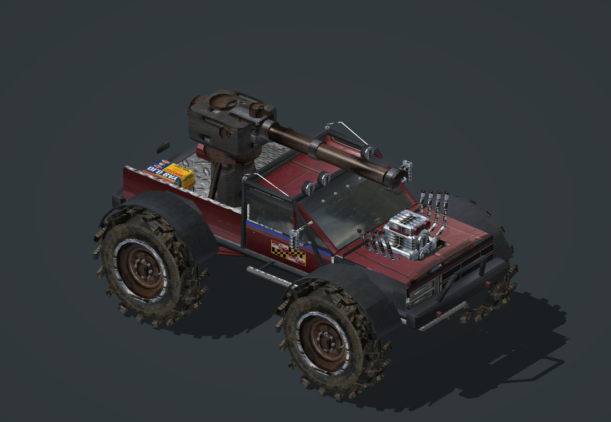

# Standard unit-model workflow

Adopted at the user's request on 2026-08-30 after approval of the Monster Mud Tank revision 2 render. This is the default start-to-finish process for this project's custom unit art. Its proven implementation is rigid hard-surface vehicles; infantry, skinning, walkers and aircraft need additional animation/export work rather than an assumed drop-in conversion.

## Visual benchmark and evidence



[Rear reference](docs/unit-art/reference/monster-truck-approved-rear.png) · [Frozen model report](docs/unit-art/reference/monster-truck-approved.report.json) · [Implementation notes](src/Art/PM/README.md)

The benchmark is a readable silhouette, convincing construction, correctly placed surface details, and a finished render of the actual asset. It is not a requirement that every unit look like a monster truck or use its polygon count. This reference used 13,812 triangles, 39,228 exported vertices and seven rigid meshes. The user approved its appearance; live gameplay was not verified in that render task.

The successful pass reused the existing diffuse atlas and portrait. Its improvement came from repairing geometry and UVs, adjusting proportions, adding meaningful silhouette detail, correcting materials and rig placement, and inspecting repeated real-model renders. More image generation or more polygons is not the default solution.

## 1. Define the unit and protect the baseline

Write a short brief: stock replacement slot, faction, role, silhouette, three recognizable features, dominant materials and approximate scale. Separate visual equipment from implemented abilities. Select a compatible stock draw/movement/targeting setup before designing the rig. A TankDraw object does not gain working wheel animation simply because wheel bones exist.

Inspect `git status`, the active manifest/build staging, the unit report, geometry, exporter, material code and behavior override. Legacy `src/Data` design XML may not drive the playable object. Identify generator side effects before importing a module; a nominal test/read can regenerate art.

Record which files this task owns. One writer per unit and one SDK build at a time. If another task changes owned files or assertions, do not silently absorb or overwrite those edits. Save the candidate and resolve the overlap. Alternate `-OutputDirectory` builds still share SDK staging and caches.

Save a uniquely named baseline under `build/baselines/` with relevant source, art, reports and any package being replaced. Preserve unrelated changes. Capture a before render for an existing unit. For a new unit, save the initial blockout before refinement.

## 2. Build the silhouette in editable geometry

Use the existing code-generated hard-surface pipeline: boxes with bevels, shaped panels, beams, cylinders and lathed profiles. Keep unique asset IDs and a unit-specific geometry module/exporter/material module. Reuse proven math, not another unit's dimensions or bone names.

Build in this order:

1. Major masses: chassis, body/cab, wheels/tracks, weapon mount.
2. Proportions and negative space: ground clearance, wheel openings, window areas, open bed, weapon clearance.
3. Structural features: guards, pillars, axle/suspension connections, turret riser and braces.
4. Readable identity: exposed engine, distinctive cannon, exhausts, lights, faction decals.
5. Small hardware only where it remains visible at gameplay scale.

Model silhouette-changing details such as chunky tread, fender arcs and barrel openings. Use textures for shallow wear and small surface detail. Avoid spending triangles on invisible interiors while the exterior still has gaps. Set a unit-appropriate budget; assess army-scale and distance-LOD cost separately.

Design part groups and skeleton together. Reserved prefixes route geometry to rigid parts: decorative wheel guards must not accidentally receive wheel-animation prefixes. Keep model coordinates, offsets, scaled pivots, parent indices and attachment names consistent. For this pipeline +X is forward and +Z is up; confirm the selected draw module's conventions.

## 3. Prove surfaces face outward

Enable backface culling in the preview. Do not hide a winding defect by making the whole model double-sided.

- Test externally meaningful directions: windshield up/forward, grille forward, doors and outer bed walls away from the centerline, sidewalls toward the exterior, tread away from its axle.
- Check mirrored sides and each lathe axis independently. A deep-dish rim can turn inward along the axle while its visible face still points outward. Closed profiles need their own orientation reasoning.
- Check finite vertices, nonzero triangle area, sensible bounds, normal length and agreement with geometric normals.
- Smooth intended curved surfaces before splitting/exporting, using actual geometry-group identities. Preserve sharp edges and do not pass mesh IDs into a function that expects group-name patterns.

The broken Prius and mud truck passed some old checks because both triangles and authored normals pointed inward. A normal agreeing with its triangle is necessary but does not prove exterior visibility.

## 4. Map and shade the actual parts

Inspect the atlas before touching UVs. Distinguish a seamless material patch from a picture of a whole component on a background. Do not paste a complete wheel, door or supercharger illustration onto every triangle.

- Use continuous projections over each intended panel/component. Compute group bounds before assigning generic component UVs where needed.
- Map wheel faces radially. Map tread around its circumference or use appropriately mapped modeled cleats; inspect seam continuity.
- Crop painted component illustrations to their useful surface, excluding backgrounds, unrelated borders and repeated windows. Decals must remain readable and consistently oriented.
- Keep UV islands inside their cells with padding. Clamping can collapse triangles: test UV area and tangent-frame validity, not just coordinates within 0–1.
- Fail clearly on unknown material names. Never silently turn a misspelled chrome material into the first paint swatch.
- Reuse existing source artwork when mapping is the defect. If new raster art is needed, use the required image-generation/editing workflow, preserve its prompt/provenance, and inspect the actual atlas layout.

Preserve the proven `ObjectsGDI.fx` four-map contract unless a shader change is the explicit task: diffuse color; tangent-space normal; specular R/highlight, G/environment reflection, B/house-color glow; recolor luminance plus team-mask alpha. This is not a modern roughness/metalness packing convention. Keep rubber matte, paint restrained and metal/glass distinct. Team masks should preserve identifying graphics, as the truck's narrow beltline stripe preserves the Maryland flag.

Internal UVs use image-top-origin V. W3X exports `1 - internalV`, and the SDK applies its conversion. OBJ also needs bottom-origin V. Verify the compiled result rather than guessing another texture flip. OBJ exports must place rigid parts at world pivots, not stack all local meshes at the origin.

## 5. Render, inspect, refine

Render the same geometry, smoothed normals, UVs and maps that feed W3X. This is the central feedback loop, not a final decorative step.

Keep a fixed front, rear, side and highlight-stress view for comparisons. Inspect both sides, the underside when relevant, and the model at normal RTS size. Use close framing for the delivery image, but do not let a flattering angle hide missing faces, buried weapons or bad proportions. These software renders approximate game lighting; label them accordingly.

For each pass, state the visible defect, likely cause and smallest useful check. Change one subsystem at a time when diagnosing a defect, rerender under the same conditions, and compare with the checkpoint. If two attempts fail, inspect geometry/material data or isolate the problem instead of adding detail or changing random shader constants.

Inspect for complete surfaces, solid-looking tires, wheel/body clearance, grounded stance, coherent materials, legible decals, restrained highlights, weapon readability and consistent appearance from the rear. Save a reference frame at each meaningful improvement.

The current reusable renderer is `tools/render_dually_preview.js`; despite its historical filename it accepts texture/name prefixes, output directory, camera target and scale. `tools/render_mudtank_preview.js` is the unit wrapper example. Keep the wrapper and a repeatable command with every new unit.

## 6. Validate the rig, clearance and simulation bounds

Verify rigid-part membership and reconstruction from local vertices plus world pivots. Check axle centering, parent transforms, yaw/pitch hierarchy, muzzle-tip alignment and no dropped/duplicated triangles. Pose tests should verify invariants such as axle distance and attachment alignment, not merely that rotating a finite point yields finite numbers.

Test actual obstacles in the weapon's path. The mud truck's raised cannon still intersected the center roof light; the fix was to arrange four lights around the barrel channel. Replacing a failing roof-clearance assertion with a hood-only check would not fix the defect. Check neutral clearance plus the supported movement/aiming range; clearly record any poses still unverified.

Fit the GameObject simulation box to the final visible model, separately from W3X collision bounds. State width/height/pathing/targeting consequences. Preserve combat/economy/locomotor settings unless their changes are requested. Update intentionally changed test contracts with measured evidence, retaining coverage of the original failure.

## 7. Compile an isolated candidate, then verify in-game

For a render-only request, deliver the inspected render and source checks without inventing a need to install or promote a release. For a complete playable unit, continue through these stages:

1. Run focused geometry, material and behavior tests for the candidate and relevant unchanged exemplars.
2. Confirm no other task is using shared staging and do not replace an archive a running game may be using. Do not kill the user's game.
3. Compile main and LowLOD streams to a dedicated `build/<unit>-<revision>` candidate using `tools/build_mod.ps1 -OutputDirectory ...`. Do not use `build.bat` (which installs), pass `-Install`, or use normal-release output for an experiment.
4. Verify compiled positions, normals, tangent frames, UV convention, texture formats/channels and shader bindings. Inspect unexpected compiler errors; missing stock raw-art notices are not blanket permission to ignore failures.
5. Verify the launcher selects that exact archive/configuration; record its hash. A launcher preflight is not a runtime test.
6. Test a fresh skirmish: fixed-camera appearance beside stock units; driving/turning; wheel motion; turret tracking/firing; muzzle FX; damaged/dying states; factory exits; group spacing near buildings; low settings and many-unit performance.

Record what was actually observed. An offline pose test cannot prove TruckDraw/TankDraw animation behavior; a still cannot prove motion; compilation cannot prove visual quality. Promote the candidate only within the user's authorization. Existing authorization persists; do not add unnecessary per-stage confirmation requests.

## 8. Freeze the result and hand it off

Save final renders, generated report, editable source snapshot and, if built, archive/configuration/hash in an identifiable candidate directory. Keep accepted visual references in tracked project files, not only ignored build folders. Do not overwrite an accepted reference when generating the next iteration.

Show the actual finished render in the response. Briefly describe visible improvements, any simulation changes and remaining checks. Keep these evidence states separate:

| State | Required evidence |
| --- | --- |
| Source checked | Relevant geometry/material/rig tests pass |
| Render reviewed | Front/rear/side/stress and gameplay-scale inspection |
| Visually approved | User accepts that particular rendered revision |
| Compiled | Both streams and compiled-asset checks pass |
| Runtime verified | Named scenarios observed against an identified build |
| Released | Candidate promoted with authorization |

Use this task record for each unit:

```text
Unit / stock slot / asset IDs:
Brief / signature features / art scale:
Owned files / baseline / concurrent-work constraints:
Preserved gameplay and other assets:
Pass: symptom -> hypothesis -> change -> test/render evidence:
Geometry budget / bounds / bones / material layout:
Final renders / source snapshot / report:
Tests passed and exact coverage:
Simulation changes and their effects:
Package / hash / launcher, or not built:
Visual approval / runtime scenarios observed / remaining checks:
```

## Reference implementation commands

From the repository root; these generate art and are not read-only inspection commands:

```powershell
node tools/generate_pasadena_mudtank.js
node tools/test_mudtank_geometry.js
powershell -NoProfile -ExecutionPolicy Bypass -File tools/test_mudtank_material.ps1
powershell -NoProfile -ExecutionPolicy Bypass -File tools/test_mudtank_behavior.ps1
node tools/render_mudtank_preview.js build/mudtank-review/candidate
```

Adapt IDs, dimensions, groups, contracts and wrappers for the next unit. [The older playbook](MODEL_CREATION_AGENT_PLAYBOOK.md) and [technical guide](HOW_THE_CUSTOM_UNIT_PIPELINE_WORKS.md) retain useful shader/exporter/build details; their old truck-specific baseline is historical, not the current state of every package.
