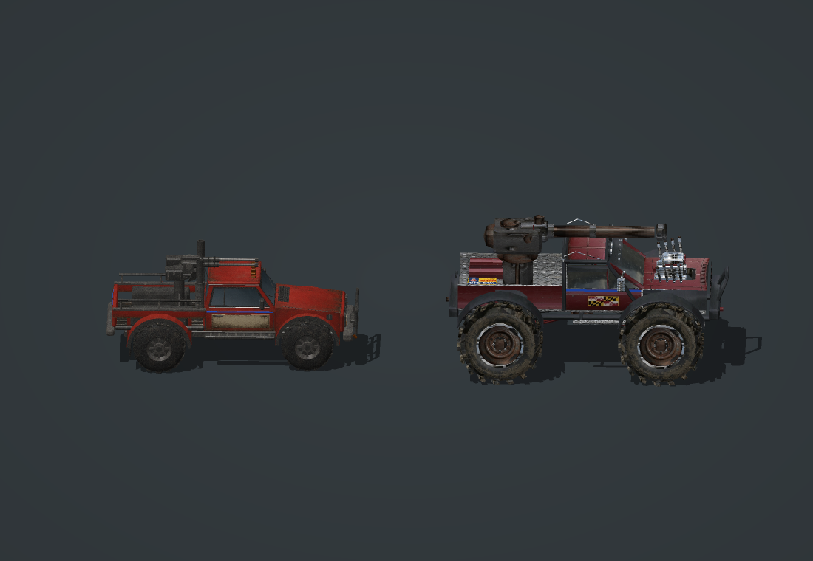

# Truck size and wheel correction v1 — 2026-08-30

The user reported an oversized F-250 beside an undersized Monster Mud Tank, and stationary monster tires while driving. This pass owns those two trucks only. The power plant, other unit work and regular release are not modified or promoted.

## Candidate changes

| Asset / stock slot | Old art scale | New art scale | New visible length × width × height | Simulation box |
| --- | --- | --- | --- | --- |
| Rolling Coal F-250 / GDIPitbull / PVDUALLY_SKIN | 0.88 | 0.66 (−25%) | 51.61 × 22.44 × 24.42 | 54 × 24 × 25 |
| Monster Mud Tank / GDIPredator / PVMUDTANK_SKIN | 0.88 | 1.10 (+25%) | 58.03 × 33.61 × 30.89 | 62 × 36 × 31 |

The monster is now about 12% longer, 50% wider and 26% taller than the F-250. This is a deliberate relative scale choice based on measured project geometry, pending in-game review. No additional screenshot was attached to this correction request.

Every vertex and rigid attachment was scaled together. The established silhouettes, UVs, triangle connectivity and all four texture maps are preserved. The F-250 remains 11,952 triangles / 26,264 vertices; the monster remains 13,812 triangles / 39,228 vertices. Both retain seven rigid meshes.

The monster inherited Predator's **TankDraw**, with scripts toggling nonexistent tread meshes. It now uses **TruckDraw**, with its four tire-bone attributes bound to `Bone_TireLF`, `Bone_TireRF`, `Bone_TireLR` and `Bone_TireRR`. Those bones drive the four corresponding rigid tire meshes. Obsolete tread-only animation states were removed; tire ground marks replace tank tracks. Model condition, turret, barrel and muzzle bindings are retained, as are the separate dust and laser draw modules.

Monster TireRotationMultiplier is provisionally `0.11363636`, the inverse of the new nominal wheel radius 8.8. It needs runtime speed/direction calibration. The F-250's existing TruckDraw wheel coefficient remains unchanged. Neither compile success nor offline wheel math proves actual wheel motion.

Combat behaviors, costs, health, weapons, armor, upgrades and locomotor configuration are retained. Resized simulation boxes change spacing/pathing and targeting/contact extents. They contain neutral geometry; turned-wheel and aimed-weapon envelopes, factory exits and group spacing still require runtime checks.

## Actual-model render evidence



[Front](truck-size-fixed-front.png) · [Rear](truck-size-fixed-rear.png) · [Highlight stress](truck-size-fixed-sun-check.png)

These are actual geometry/material software renders with approximate game lighting, not concept images or game screenshots. All four views were inspected. Accepted prior renders were preserved. The technical comparison renderer packs the unchanged material maps into one atlas and places both meshes in one scene at the same scale.

## Validation and package

- Geometry checks passed for exterior-facing surfaces, finite vertices, UVs, tangent frames, rigid-part reconstruction, wheel attachment and neutral muzzle/roof clearance. Full turret pose clearance is not established.
- Material and object checks passed. The monster test checks actual TruckDraw wheel attributes against W3X bones/subobjects and preserves full stock combat Behaviors, locomotor, armor and body definitions.
- Baseline comparison checked all 65,492 exported vertices and all 21 pivots for uniform scaling, with unchanged topology, UVs, rigid membership and texture hashes.
- Shared main and LowLOD compilation passed. Compiled vertex, UV, tangent-frame and DDS/channel checks passed for both trucks and the other included custom vehicles. No other SDK build ran concurrently.
- Candidate: `build/truck-scale-wheels-v1/MDShowdown.big`, 57,606,893 bytes, SHA256 `5C6993DCEE076FB51A28F173347FFCC7B2156BF853883A2C6EC58F91C192AD2F`.
- Dedicated launcher: `launch_truck_fix.bat`; selects the candidate's `MDShowdown_1.0.skudef`. Preflight passed.
- Regular `build/MDShowdown.big` remains SHA256 `2833A76CC896B0E7A891A38E1CCC1B66293333A84CBAAF20A616F8CC0A405EA4`.

Runtime attempt: the default launch produced no game window. A second launch outside the sandbox returned **100010** before a game window appeared. No running user game was terminated. **Live driving, wheel motion, aiming/firing, damage states, factory exits, low settings and army performance remain unverified.** This candidate has not been visually accepted or promoted to the regular release. Launch it manually after closing C&C 3 to test both vehicles together before continuing to the power plant.

Baseline: `build/baselines/truck-size-wheels-20260830-210818/`, including pre-fix art/source and hashes. Frozen candidate art/source, staged truck XML and SHA256 inventory: `build/truck-size-review/finished-v1/`. Candidate compile logs remain beside the archive. Historical artVersion values identify retained surface designs; `truck-size-wheels-v1` and package/source hashes identify this size/rig revision.

## Reproduction

Do not run these while another task uses shared SDK staging. The renderer imports the F-250 generator and rewrites that art.

```powershell
node tools/generate_pasadena_dually.js
node tools/generate_pasadena_mudtank.js
node tools/test_dually_geometry.js
node tools/test_mudtank_geometry.js
node tools/test_truck_relative_size.js
node tools/test_truck_scale_regression.js build/baselines/truck-size-wheels-20260830-210818
powershell -NoProfile -ExecutionPolicy Bypass -File tools/test_dually_behavior.ps1
powershell -NoProfile -ExecutionPolicy Bypass -File tools/test_mudtank_behavior.ps1
node tools/render_truck_size_comparison.js build/truck-size-review
powershell -NoProfile -ExecutionPolicy Bypass -File tools/build_mod.ps1 -OutputDirectory build/truck-scale-wheels-v1
powershell -NoProfile -ExecutionPolicy Bypass -File tools/launch_mod.ps1 -TruckFixPreview -CheckOnly
```
